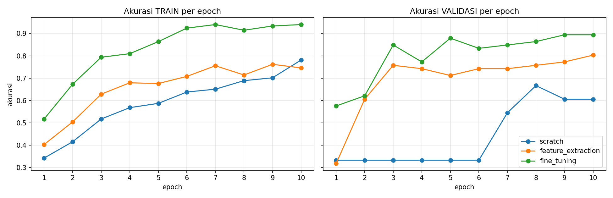
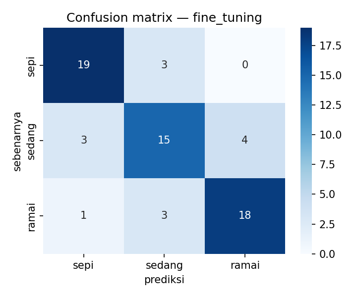

# TF_Klasifikasi_Keramaian_SANINDO

**Klasifikasi Tingkat Keramaian Ruangan dengan Transfer Learning (MobileNetV2)**

Image Classification menggunakan Transfer Learning untuk mengklasifikasikan tingkat keramaian ruangan ke dalam 3 kategori: `sepi`, `sedang`, `ramai`.

Notebook ini membandingkan **3 mode pelatihan** pada arsitektur yang sama (MobileNetV2): *training from scratch*, *feature extraction*, dan *fine-tuning*. Hasilnya disajikan dalam tabel perbandingan, grafik akurasi per epoch, dan pengukuran latensi model terpilih.

> **Kelompok:** `<isi nama kelompok>`
> **Anggota:** `<isi nama & NIM anggota>`
> **Mata kuliah:** `<isi nama mata kuliah>`

---

## Dataset

Dataset: **SANINDO v1i** (Roboflow, format COCO) — 3.235 frame dari 24 video ruang kerja/lab, resolusi 512×512, lisensi CC BY 4.0.

Dataset aslinya dibuat untuk *object detection* dengan satu kelas anotasi (`person`). Agar dapat dipakai untuk klasifikasi, label tiap citra **diturunkan dari jumlah anotasi `person` per citra**:

| Kelas | Aturan | Deskripsi |
|---|---|---|
| `sepi` | 0–2 orang | Ruangan lengang |
| `sedang` | 3 orang | Ruangan terisi sedang |
| `ramai` | ≥ 4 orang | Ruangan ramai |

Aturan ini dapat diubah pada fungsi `CLASS_RULE` di sel konfigurasi notebook.

**Jumlah citra per kelas** (seluruh dataset, sebelum subsampling):

| Kelas | Train | Valid | Test | Total |
|---|---|---|---|---|
| `sepi` | 860 | 278 | 132 | 1.270 |
| `sedang` | 772 | 215 | 97 | 1.084 |
| `ramai` | 633 | 154 | 94 | 881 |

Untuk mempercepat training, notebook menyediakan parameter `N_PER_CLASS` (default 150 citra/kelas, split 70/15/15). Syarat tugas **≥ 50 citra per kelas** dicek otomatis oleh notebook.

Dataset (`SANINDO.v1i.coco.zip`) dapat diunduh dari: `<isi link Roboflow / Google Drive>`

---

## Struktur Repository

```
.
├── Transfer_Learning_SANINDO.ipynb   # Notebook utama
├── README.md                         # Dokumen ini
├── metadata.csv                      # Metadata per citra (hasil notebook)
├── dataset_raw/                      # Citra per kelas (hasil notebook)
│   ├── sepi/
│   ├── sedang/
│   └── ramai/
└── outputs/
    ├── tabel_hasil_3_mode.csv        # Tabel perbandingan 3 mode
    ├── history_per_epoch.csv         # Loss & akurasi tiap epoch
    ├── grafik_akurasi_per_epoch.png  # Grafik akurasi train/val per epoch
    ├── confusion_matrix.png          # Confusion matrix model terpilih
    ├── latensi_model_terpilih.csv    # Hasil pengukuran latensi
    └── *_best.pt                     # Checkpoint terbaik tiap mode
```

`metadata.csv` berisi kolom: `filepath`, `filename`, `original_name`, `video_id`, `n_person`, `label`, `split`.

---

## Alur Notebook

1. **Dokumen Desain Awal** — perumusan masalah, definisi kelas, model dasar, 3 mode, metrik, dan risiko eksperimen
2. **Setup & Konfigurasi** — seed, device (CPU/GPU), dan parameter (`IMG_SIZE`, `EPOCHS`, `N_PER_CLASS`, dst.)
3. **Dataset** — ekstrak zip, hitung jumlah orang per citra dari anotasi COCO, tentukan kelas, buat `dataset_raw/` dan `metadata.csv`, validasi ≥ 50 citra/kelas, visualisasi distribusi dan contoh citra
4. **DataLoader** — preprocessing (resize, normalisasi ImageNet) dan augmentasi ringan (flip, color jitter) khusus data training
5. **Model & 3 Mode Transfer Learning** — MobileNetV2 dengan head klasifikasi baru:

   | Mode | Inisialisasi | Layer yang dilatih |
   |---|---|---|
   | `scratch` | Acak | Semua layer (baseline) |
   | `feature_extraction` | ImageNet | Hanya classifier head (backbone beku) |
   | `fine_tuning` | ImageNet | Blok terakhir backbone + head (LR kecil) |

6. **Training** — Adam + Cross-Entropy, `EPOCHS` sama untuk ketiga mode; checkpoint terbaik dipilih dari akurasi validasi
7. **Hasil** — tabel perbandingan 3 mode dan grafik akurasi train/validasi per epoch
8. **Evaluasi Model Terpilih** — classification report dan confusion matrix pada test set
9. **Latensi** — pengukuran waktu inferensi model terpilih (batch = 1)
10. **Analisis** — pembuatan `README.md` otomatis berisi tabel, grafik, latensi, dan draf analisis

---

## Hasil

> Bagian ini diisi dari output notebook setelah training selesai.

### Tabel perbandingan 3 mode

| Mode | Param terlatih | Best val acc | Epoch terbaik | Test acc | Test macro-F1 | Waktu training (s) |
|---|---|---|---|---|---|---|
| `scratch` | | | | | | |
| `feature_extraction` | | | | | | |
| `fine_tuning` | | | | | | |

### Grafik akurasi per epoch



### Confusion matrix model terpilih



### Latensi model terpilih

Model terpilih: `<isi mode terbaik>`

| Perangkat | Mean (ms) | Median (ms) | P95 (ms) | FPS |
|---|---|---|---|---|
| CPU | | | | |
| GPU (jika ada) | | | | |

Pengukuran: batch = 1, input `<IMG_SIZE>`×`<IMG_SIZE>`, warm-up 20 iterasi, 200 iterasi terukur, hanya forward pass.

---

## Analisis Singkat

> Lengkapi setelah hasil tersedia.

- **Perbandingan mode:** mode mana yang paling akurat dan seberapa besar selisihnya terhadap `scratch`?
- **Kecepatan konvergensi:** mode mana yang paling cepat mencapai akurasi validasi tinggi?
- **Overfitting:** bagaimana selisih akurasi train dan validasi pada tiap mode?
- **Kesalahan klasifikasi:** kelas mana yang paling sering tertukar (misalnya `sedang` di antara `sepi` dan `ramai`) dan mengapa?
- **Trade-off:** akurasi vs. waktu training vs. latensi inferensi.

### Keterbatasan

- Label diturunkan dari jumlah anotasi `person`, bukan label klasifikasi asli. Orang yang kecil atau terhalang dapat membuat label bising.
- Citra berasal dari video yang sama. Dengan split acak per frame, frame yang mirip dapat muncul di train dan test (*data leakage*) sehingga akurasi bisa terlalu optimis. Opsi `SPLIT_BY_VIDEO = True` memisahkan data berdasarkan ID video.
- Eksperimen dijalankan dengan satu seed; selisih kecil antar mode belum tentu signifikan.
- Jumlah citra yang dikurangi (`N_PER_CLASS`) membuat data validasi dan test kecil sehingga akurasi lebih fluktuatif.

---

## Cara Menjalankan

### Opsi A — Lokal (VS Code)

1. Letakkan `Transfer_Learning_SANINDO.ipynb` dan file zip dataset (`SANINDO*.zip`) dalam **satu folder**, lalu buka folder itu di VS Code.
2. Pilih kernel Python (*Select Kernel*) dan pasang `ipykernel` bila diminta.
3. Pasang library:
   ```bash
   pip install torch torchvision scikit-learn pandas matplotlib seaborn tabulate
   ```
4. Jalankan seluruh sel **berurutan dari atas** (jangan melompati sel konfigurasi).

### Opsi B — Google Colab

1. Buka notebook di Google Colab, aktifkan GPU: *Runtime → Change runtime type → T4 GPU*.
2. Upload zip dataset ke sesi Colab (panel *Files*), atau biarkan notebook meminta upload.
3. Jalankan seluruh sel secara berurutan (*Runtime → Run all*).

### Pengaturan penting (sel Bagian 1)

| Parameter | Default | Keterangan |
|---|---|---|
| `N_PER_CLASS` | 150 | Citra per kelas (`None` = semua, minimal 50) |
| `IMG_SIZE` | 224 | Ukuran input; kecilkan (mis. 128) agar lebih cepat |
| `EPOCHS` | 10 | Jumlah epoch tiap mode |
| `BATCH_SIZE` | 32 | Ukuran batch |
| `SPLIT_BY_VIDEO` | `False` | `True` = split per video (anti-leakage) |

**Catatan waktu training:** di GPU, seluruh training 3 mode biasanya selesai dalam hitungan menit. Di CPU bisa jauh lebih lama; kurangi `EPOCHS`, `IMG_SIZE`, atau `N_PER_CLASS`.

**Catatan Windows:** `num_workers` pada DataLoader diset `0` karena worker > 0 sering crash di Windows saat dijalankan dari Jupyter/VS Code.

---

## Tech Used

- Python 3
- PyTorch / torchvision — MobileNetV2 (Transfer Learning, pretrained ImageNet)
- scikit-learn — metrik evaluasi (accuracy, macro-F1, confusion matrix, classification report)
- pandas, matplotlib, seaborn — pengolahan data dan visualisasi
- Google Colab / VS Code Jupyter — lingkungan eksekusi
